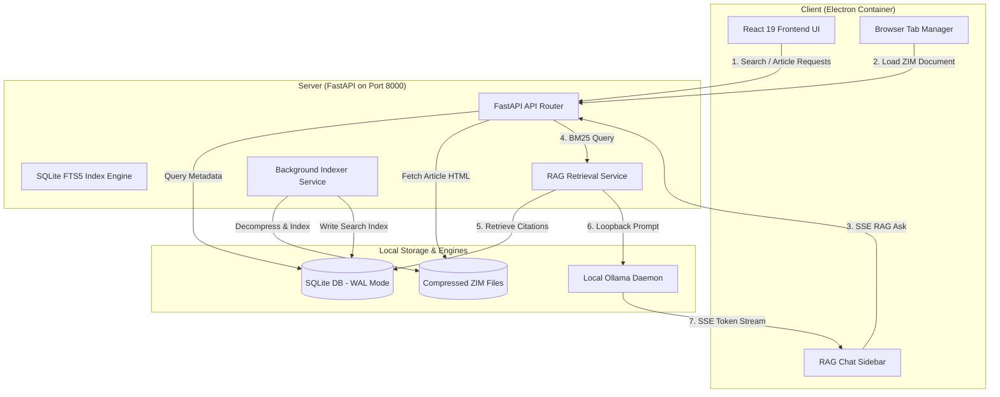

# 🥝 Kiwi: Offline Knowledge OS

### *Empowering Local, Offline Intelligence at the Edge*


---

## 📋 Tagline
An enterprise-grade, local-first search and offline RAG AI chat system designed to index and extract knowledge from compressed ZIM archives, enabling low-latency lookup and intelligent question-answering with zero internet dependencies.

---

## 🛡️ Project Status & Badges
[](LICENSE)
[](#)
[](#)
[](#)
[](#)
[](#)
[](#)
[](https://chatterbolic.co.za)

---

## 👁️ Project Preview
Kiwi delivers a highly polished desktop experience containing a global Command Palette (Ctrl+K), tabbed article browsing, structured search results matching, and an interactive RAG chat window. 

```
┌────────────────────────────────────────────────────────┐
│  [≡] Kiwi OS  [Search]   [React 19] x  [FastAPI] x  +  │
├────────────────────────────────────────────────────────┤
│ 🔍 Search Wikipedia...                          [Ctrl+K]│
├────────────────────────────────────────────────────────┤
│  SearchResults (140,240 articles indexed)              │
│  - Photosynthesis [Wiki] — Process used by plants...  │
│  - Coding Standards [DevDocs] — Formatting rules...   │
│                                                        │
└────────────────────────────────────────────────────────┘
```

---

## 🎥 Demo
*(To record a live capture of your running Kiwi instance, launch with `start.bat -Dev` and place your `.gif` animation inside `.github/assets/demo.gif`)*

---

## ✨ Key Features
- **Zero-Latency Full-Text Search**: Leverage SQLite FTS5 virtual tables to scan hundreds of thousands of offline articles in `< 100ms`.
- **Direct ZIM Parsing**: Stream compressed data directly from standard `.zim` files (Wikipedia, StackExchange, DevDocs) using Python `libzim` bindings.
- **Offline RAG AI Chat**: Chat naturally with your offline database. Context-appropriate citations are automatically compiled and injected into a local Ollama model.
- **Desktop First Integration**: Electron shell container coordinates execution of python services and React browser windows in a native application context.
- **Multi-Tab Browsing**: Open, read, and cross-reference multiple ZIM articles concurrently using a sleek tabbed interface.
- **Deferred Indexing**: Intelligent scheduling delays directory indexing threads for 5 seconds on startup, letting frontend queries resolve first without GIL lag.

---

## 💡 Why This Exists
In South Africa's diverse business landscapes—ranging from agricultural centers in Mpumalanga to industrial hubs—reliable, high-bandwidth internet connectivity is not always guaranteed. 

Kiwi was engineered by **Chatterbolic Solutions** to demonstrate that **high-performance AI does not require the cloud**. By combining standard compressed ZIM libraries with highly optimized local databases and edge-based LLM daemons, Kiwi provides organizations with access to massive technical libraries, manuals, and generative AI support completely offline. It represents our core engineering philosophy: **practical, implementation-focused systems that work under real-world constraints**.

---

## 🏗️ Architecture Overview
Kiwi consists of a React frontend served via Vite, running inside an Electron wrapper, talking to a Python FastAPI backend. The backend manages direct file handles on compressed ZIM archives and handles search indices in a WAL-tuned SQLite database, feeding retrieved contexts into a local Ollama process.



---

## 📸 Screenshots
*(Place UI screenshots in `.github/assets/search-panel.png` and `.github/assets/chat-interface.png` for public rendering)*

---

## ⚙️ Installation

### 📋 Prerequisites
1. **Python 3.10+** (Ensure `python` is added to your environment `PATH`).
2. **Node.js 18+** (Includes `npm`).
3. **Ollama** (Running locally).
   - Pull the default model: `ollama pull gemma3:1b`
4. **ZIM Archives**: Download ZIM files (e.g., Simple Wikipedia) from Kiwix and place them in a folder.

---

## 🚀 Quick Start
Kiwi contains a PowerShell launcher script that automatically provisions virtual environments, installs dependencies, and launches both frontend and backend.

### Running in Production Mode (Prebuilt Assets)
To compile assets and launch the app in optimized production mode:
```cmd
start.bat
```

### Running in Development Mode (Hot-Reload Enabled)
To work on code with hot-reloads active for FastAPI (`uvicorn --reload`) and React (`Vite HMR`):
```cmd
start.bat -Dev
```

---

## 📖 Usage Examples

### 1. Auto-Scanning ZIM Archives
When starting, Kiwi scans the folder specified in **Settings**. 
- Go to the **Settings** panel (via sidebar or Command Palette `Ctrl+K`).
- Enter the absolute directory containing your `.zim` files.
- Click **Save**. The background indexer will automatically scan and catalog files.

### 2. Fast Article Searching
- Go to the **Search** tab.
- Type in keywords (e.g. `Photosynthesis`). Search results return instantly.
- Click on a search result to open it in a new reader tab.

### 3. RAG-Enabled Local Chat
- Open the Chat Sidebar (click the chat icon or press `Ctrl+B` then toggle chat).
- Ask a question: `How do plants create food?`
- The system retrieves the top 8 relevant indexed articles, inserts them as citations, feeds them to `gemma3:1b` over loopback, and streams the answer with inline source citations (e.g., `[1]`, `[2]`).

---

## 💻 Developer Experience
We prioritize developer velocity. The launcher script (`start.ps1`) automates setup tasks:
- **Port Management**: The script automatically checks and terminates running processes on ports `8000` (FastAPI) and `5173` (Vite) before starting, avoiding annoying port-in-use errors.
- **Smart Pip Install**: The script hashes `requirements.txt` and only triggers `pip install` when dependencies actually change, accelerating boot times.
- **Vite-Electron Tunneling**: Setting `KIWI_FORCE_DEV=1` instructs Electron to bypass precompiled production folders and load the live HMR server directly.

---

## 🤖 AI & Automation Features
- **Prompt Architecture**: Prompt templates include history truncation (capped at 8 turns and 600 characters per message) to protect Gemma-3's context window.
- **Retrieval Thresholding**: We assess keyword overlap density. If fewer than 2 sources overlap, Kiwi appends a warning tag prompting the model to use general knowledge and prepend responses with `"From general knowledge:"` rather than hallucinating citations.
- **Multilingual Support**: Supports Afrikaans, English, and Zulu prompts through local LLM fine-tuning options.

---

## ⚡ Performance Characteristics
- **SQLite WAL Mode**: Running `PRAGMA journal_mode=WAL` and `PRAGMA synchronous=NORMAL` allows SQLite to run full-text writes during indexing without locking concurrent reader queries.
- **Page Cache Tuning**: Set to `-20000` (~20MB memory cache) to ensure database index page hits remain memory-resident.
- **Database Index Deduping**: Programmatically dedupes redundant index elements on startup, maintaining index integrity.

---

## 🛠️ Tech Stack
- **Frontend Core**: React 19, TypeScript 6.0, Vite 8.0, Electron 30.0
- **Frontend Styling**: Vanilla CSS, Tailwind CSS 4.3
- **Backend API**: FastAPI, Uvicorn
- **Database & Search**: SQLite FTS5, SQLAlchemy 2.0, Alembic
- **ZIM Parsing**: python-libzim 3.0
- **Local AI Daemon**: Ollama (`gemma3:1b` GGUF)

---

## 📁 Project Structure
```
knowledge-system/
├── .github/                 # GitHub workflows & templates
│   ├── assets/              # Branding logo & screenshots
│   └── workflows/           # CI/CD pipelines
├── backend/                 # FastAPI application
│   ├── alembic/             # DB schema migration versions
│   ├── app/                 # Backend source modules
│   │   ├── api/             # API routes (search, chat, archives)
│   │   ├── core/            # Config, DB connections, settings
│   │   └── services/        # RAG pipelines, Indexer, LLM connectors
│   └── requirements.txt     # Python requirements
├── frontend/                # React / Electron application
│   ├── electron/            # Main Electron process
│   ├── src/                 # React UI source code
│   └── package.json         # Node scripts & dependencies
├── start.bat                # Windows Launcher (CMD wrapper)
└── start.ps1                # PowerShell orchestrator script
```

---

## ⚙️ Configuration
Backend settings are located in `backend/app/core/config.py`.
Key configurable options include:
- `INDEX_BATCH_SIZE`: Number of articles processed before committing to the SQLite database (default: `1000`).
- `MAX_SUMMARY_LENGTH`: Length limit for search summaries (default: `500` characters).
- `RATE_LIMIT_PER_MINUTE`: Protects backend routes from loop overheads (default: `60` requests/min).

---

## 🌐 Environment Variables
- `KIWI_FORCE_DEV`: Set to `1` to run Electron in HMR dev mode. Set to `0` for production dist.
- `DATABASE_PATH`: Custom path override for SQLite DB (default: `backend/data/knowledge.db`).

---

## 📦 Build Instructions
To bundle the Electron application into a standalone installer or portable executable:
```bash
cd frontend
npm run electron:pack
```
This outputs compiled multi-platform builds inside `frontend/release/`.

---

## 🔄 Release Workflow
1. Run lint tests: `npm run lint` and `flake8 .`
2. Run test suites: `npm run test` and `pytest`
3. Update version strings in `package.json` and `backend/app/core/config.py`.
4. Compile production frontend bundle: `npm run build`
5. Package application: `npm run electron:pack`

---

## 🗺️ Roadmap
- [x] Full-Text Search and libzim extraction.
- [x] Local RAG AI chat via Ollama.
- [ ] Context-aware auto-suggest during FTS querying.
- [ ] Support for directory-level scanning of split ZIM files.
- [ ] Custom South African translation model fine-tuning (English to Afrikaans/Zulu) on device.

---

## 🤝 Contributing
Contributions make the open-source community an amazing place. Please review our [CONTRIBUTING.md](CONTRIBUTING.md) for style guidelines, test configurations, and pull request procedures.

---

## 📄 License
Distributed under the MIT License. See [LICENSE](LICENSE) for details.

---

## 🏢 About Chatterbolic Solutions
Chatterbolic Solutions is a Nelspruit (Mbombela) based technology provider specializing in AI automation, custom software development, and workflow systems for South African businesses. 

Our core products include:
- **AI Voice Agents**: 24/7 web-based receptionists handling inbound enquiries, qualifies leads, and books appointments in local languages (English, Afrikaans, Zulu).
- **Custom Chatbots**: Localized RAG systems trained on company knowledge.
- **Workflow Automation**: CRM integration, lead tracking, and process optimization.

Learn more at [chatterbolic.co.za](https://chatterbolic.co.za).

---

## 📞 Contact / Links
- **Website**: [chatterbolic.co.za](https://chatterbolic.co.za)
- **Phone/WhatsApp**: +27 (0)79 063 4133
- **Email**: taariq27e@gmail.com
- **Services**: [chatterbolic.co.za/services](https://chatterbolic.co.za/services)
- **Why Choose Us**: [chatterbolic.co.za/why-choose-us](https://chatterbolic.co.za/why-choose-us)
- **Company Address**: Mbombela, Mpumalanga, South Africa, 1200
